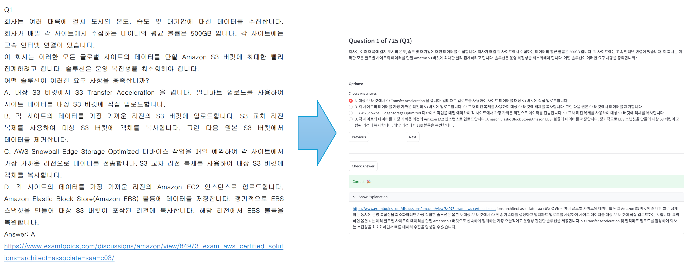

# PDF2Quiz - Interactive Exam Prep Web App


PDF2Quiz는 문제은행(덤프) PDF 파일을 분석하여, 사용자가 웹 화면에서 인터랙티브하게 문제를 풀고 정답과 해설을 바로 확인할 수 있는 대화형 퀴즈 어플리케이션입니다.

## ✨ Features

- **실시간 PDF 파싱**: 사용자가 PDF를 업로드하면 문제, 보기, 정답, 해설을 실시간으로 자동 추출합니다.
- **인터랙티브 퀴즈 UI**:
  - 단일 정답(Radio) 및 다중 정답(Checkbox) 문항 자동 인식
  - '정답 확인' 클릭 시 즉각적인 맞춤법 피드백 및 해설 제공
- **학습 편의 기능**:
  - 학습 진행도를 시각적으로 보여주는 Progress Bar
  - 특정 문제 번호로 바로 이동할 수 있는 `Jump-to-Question` 기능
  - PDF 추출 시 발생하는 텍스트 줄바꿈/인코딩을 보정하여 깔끔한 한글 지원

## 🚀 Installation & Run

1. **저장소 클론 및 폴더 이동**
   ```bash
   git clone https://github.com/duaghwls/PDF2Quiz.git
   cd PDF2Quiz
   ```

2. **가상환경 생성 및 활성화** (권장)
   ```bash
   python -m venv .venv
   
   # Windows
   .\.venv\Scripts\activate
   
   # macOS / Linux
   source .venv/bin/activate
   ```

3. **의존성 패키지 설치**
   ```bash
   pip install -r requirements.txt
   ```

4. **어플리케이션 실행**
   ```bash
   streamlit run app.py
   ```

5. **PDF 파일 업로드**
   - 문제은행 덤프 PDF 파일을 업로드합니다.
   - 본 프로젝트는 AWS SAA-C03 시험 덤프 PDF 파일을 기준으로 작성됨. (출처: https://limreus.tistory.com/194)

## 🛠️ Tech Stack & Requirements

- **Python 3.9+**
- **Streamlit**: 빠르고 간단한 웹 인터페이스 (UI Framework)
- **PyMuPDF (fitz)**: 고성능 PDF 텍스트 추출 엔진 (PDF Parser)

자세한 패키지 목록은 `requirements.txt`에 포함되어 있습니다.

## 💡 How Parser Works (파싱 규칙)

이 프로젝트의 파서 엔진은 정규표현식을 기반으로 강력한 규칙을 사용합니다:
- **시작점 식별**: 문서 상단 메타데이터를 무시하고 첫 번째 `Q1` 라인을 만난 지점부터 파싱을 시작합니다.
- **문제 식별**: `^Q\d+$` 패턴을 찾아 문항 시작을 인지합니다.
- **보기 식별**: `^[A-F]\.` 형태로 시작하는 라인을 보기로 간주합니다.
- **정답 식별**: `Answer: [A-F]+` 패턴을 식별하며, 복수 정답을 완벽하게 대응합니다.
- **해설 식별**: Answer 라인 이후부터 다음번 문제 마커가 나올 때까지의 모든 텍스트를 해설로 추출합니다.

**참고**: 본 프로젝트는 AWS SAA-C03 시험 덤프 PDF 파일(출처: https://limreus.tistory.com/194) 을 기준으로 작성됨. 다른 포맷의 PDF 파일을 사용하는 경우, 파싱 규칙을 수정해야 할 수 있습니다.

## 📸Execution Example


## 📄 License

This project is open-source and available under the [MIT License](LICENSE).
